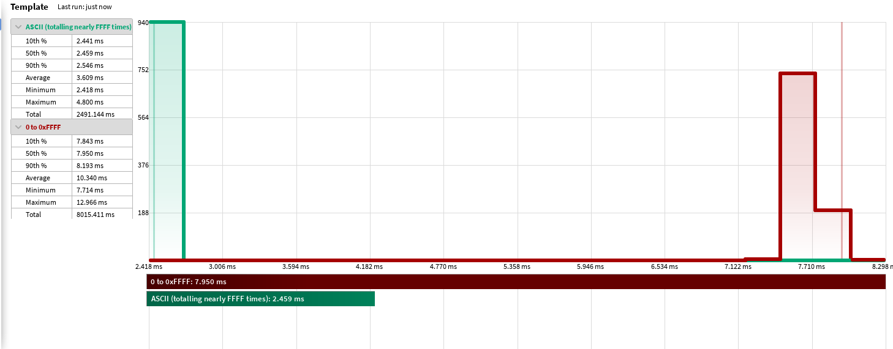

# unicode-ident-luau

Implementation of [Unicode Standard Annex #31](https://www.unicode.org/reports/tr31/) for detecting "general-purpose identifiers, immutable identifiers, hashtag identifiers, and in pattern-based syntax". Tested on Unicode 15.0.0.

Port of [https://github.com/dtolnay/unicode-ident](dtolnay/unicode-ident).

## Usage

unicode-ident-luau exposes the following functions that take codepoints (such as those from [utf8.codes](https://luau-lang.org/library#utf8-library)).

```
unicodeIdent.isXidStart(codepoint: number): boolean
unicodeIdent.isXidContinue(codepoint: number): boolean
```

### Installation

unicode-ident-luau is on wally.

```toml
unicodeIdent = "kampfkarren/unicode-ident@1.0.0"
```

## Performance

### TL;DR

- 18.8 nanoseconds per call for ASCII
- 37.6 nanoseconds per call for non-ASCII
- 12.7 KB of memory.
- My CPU is extremely good. YMMV.

### Details

unicode-ident-luau is extremely fast.

The following benchmarks consistently give the following benchmarks:

```lua
{
	["ASCII (totalling nearly FFFF times)"] = function(Profiler)
		for _ = 1, 0xFFFF / 128 do
			for c = 0, 127 do
				local _ = unicodeIdent.isXidStart(c)
				local _ = unicodeIdent.isXidContinue(c)
			end
		end
	end,

	["0 to 0xFFFF"] = function()
		for c = 1, 0xffff do
			local _ = unicodeIdent.isXidStart(c)
			local _ = unicodeIdent.isXidContinue(c)
		end
	end,
}
```

#

Dividing these by the number of iterations, we get the following metrics for both isXidStart and isXidContinue. Because they are implemented nearly identically, we will divide by 50% for the price of either.

**ASCII**: 2.459ms / 65,408 runs == 37.6 nanoseconds for both / **18.8 nanoseconds** for either.

**Non-ASCII**: 7.950ms / 65,535 runs == 121.3 nanoseconds for both / **60.65 nanoseconds** for either.

Note that these benchmarks (and similar ones performed outside of Benchmarker) don't seem to improve with `--!native`.

The necessary tables are stored in an extremely compressed manner. The Luau heap manager reports the tables as being 10.4 KB, but in a game the cost of the script bytecode is an additional 2,359 bytes, so about 12.7 KB.
